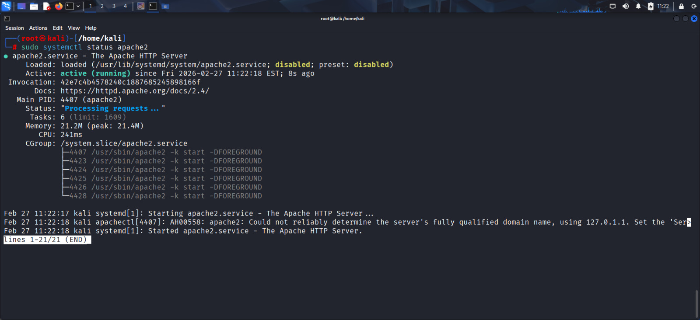
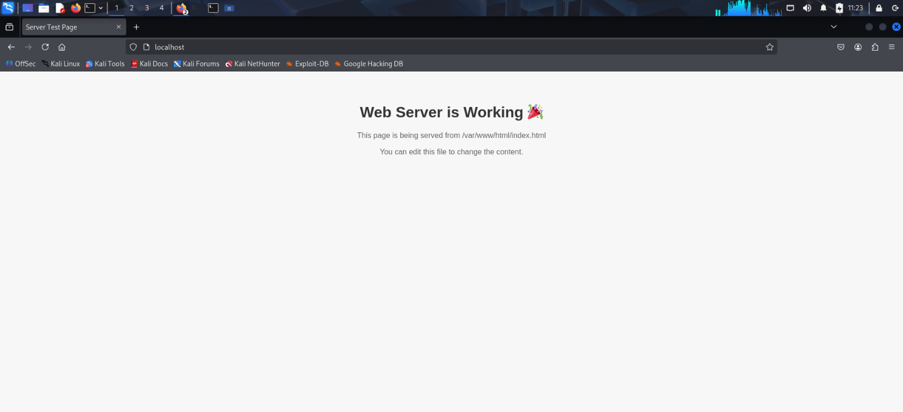
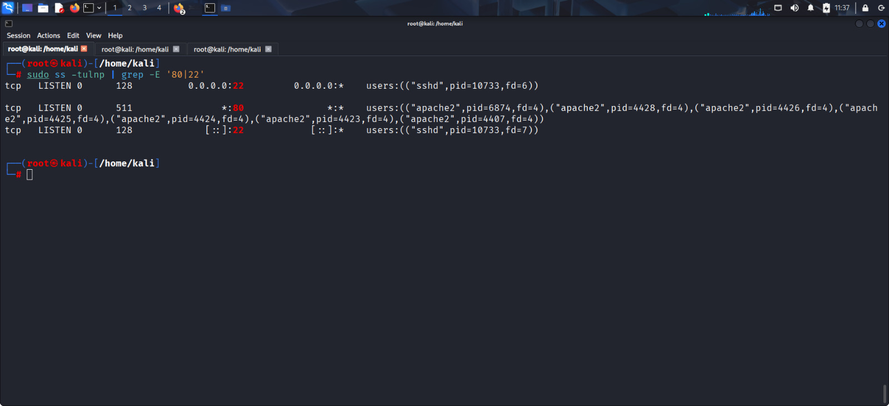
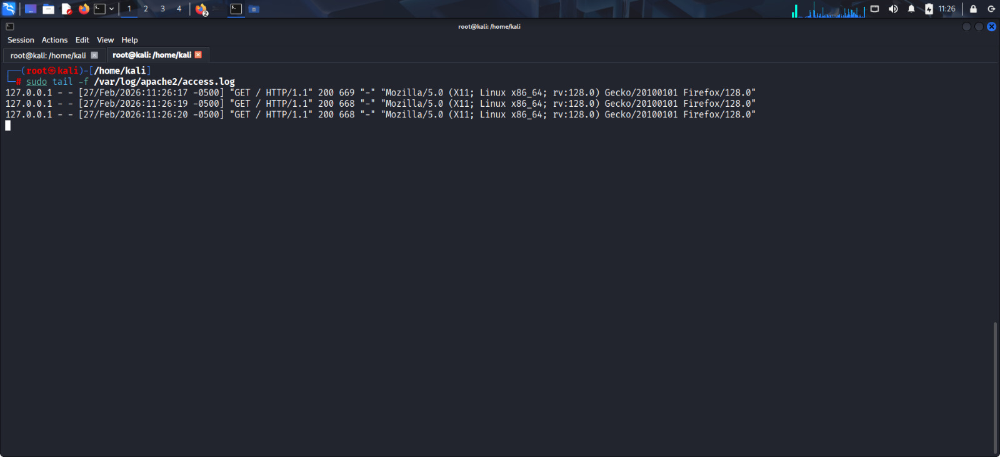
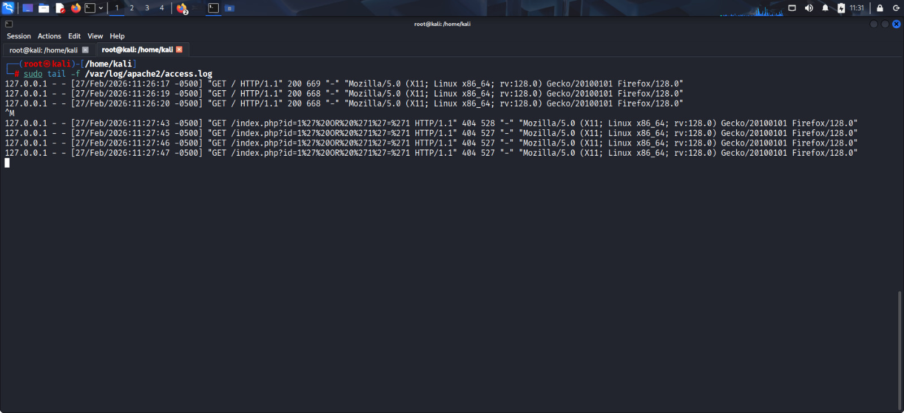
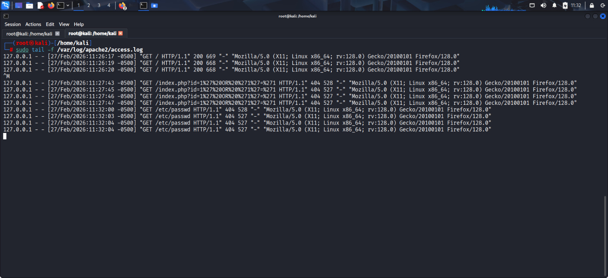
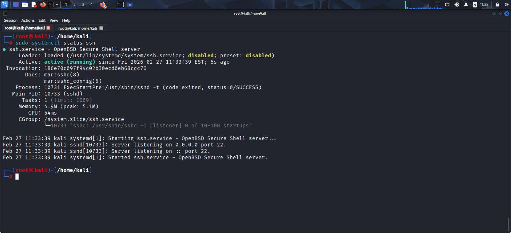
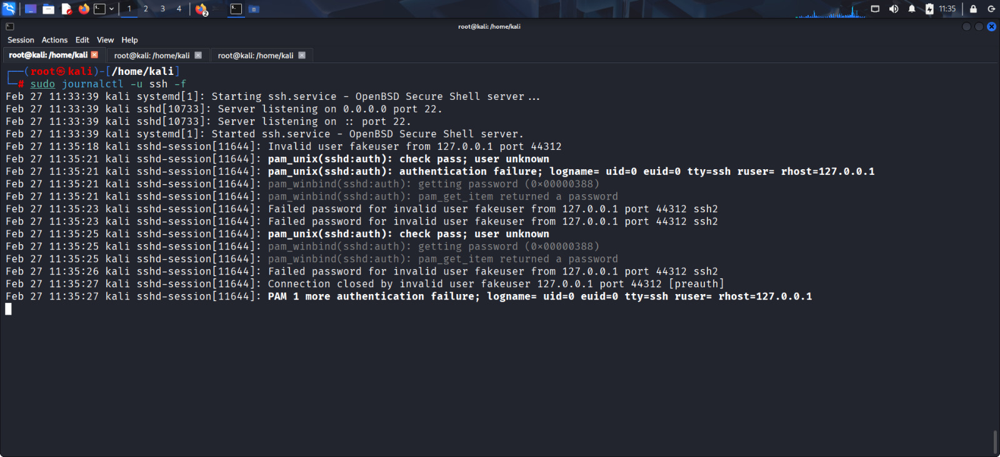

# 🔐 Security Monitoring & Incident Response

## 📌 Project Overview

This project simulates a real-world Security Operations Center (SOC) environment.  
The objective was to monitor system logs, detect suspicious activities, classify incidents by severity, and define structured response workflows.

The lab environment was built using **Kali Linux**, **Apache Web Server**, and **OpenSSH**.

---

# 🖥️ Lab Environment Setup

- Operating System: Kali Linux
- Web Server: Apache2
- Authentication Service: OpenSSH
- Log Sources:
  - `/var/log/apache2/access.log`
  - `journalctl -u ssh`

---

## Apache Service Running

---

## Website Accessible via Localhost

---

## Active Listening Ports

Port 80 (HTTP) and Port 22 (SSH) confirmed active.

---

# 📊 Log Monitoring & Analysis

## Normal Traffic Observation

Successful HTTP request (Status 200) observed in Apache access logs.

---

## SQL Injection Attempt

### Analysis
The request contains a URL-encoded SQL payload:

`%27%20OR%20%271%27=%271`

Decoded form:

`' OR '1'='1`

This indicates an attempt to manipulate backend SQL queries.

**Severity: High**

---

## Directory Traversal Attempt

Attempt to access `/etc/passwd`, a sensitive system file.

**Severity: High**

---

# 🔐 SSH Monitoring

## SSH Service Status

---

## SSH Brute Force Detection

Multiple "Failed password" entries detected from the same IP address.

**Severity: Medium**  
Escalates to High if authentication succeeds.

---

# 🧠 Detection Logic

### Rule 1 – SQL Injection
Trigger: Request contains `' OR`, `--`, or `UNION SELECT`  
Severity: High

---

### Rule 2 – Directory Traversal
Trigger: Request contains `../` or attempts to access system files  
Severity: High

---

### Rule 3 – SSH Brute Force
Trigger: More than 5 failed login attempts within 1 minute from same IP  
Severity: Medium (High if successful login occurs)

---

# 🚨 Incident Scenarios & Response

## Scenario 1 – SQL Injection
- Review web logs
- Block IP if repeated
- Validate input sanitization
- Document incident

---

## Scenario 2 – Directory Traversal
- Block source IP
- Review file permissions
- Investigate potential exposure
- Document incident

---

## Scenario 3 – SSH Brute Force
- Temporarily block IP
- Enforce strong password policy
- Enable SSH key authentication
- Monitor for successful login
- Document incident

---

# 📈 Severity Classification

| Level  | Description |
|--------|------------|
| Low    | Single suspicious activity with no impact |
| Medium | Repeated suspicious activity without confirmed compromise |
| High   | Confirmed malicious attempt or successful compromise |

Severity determined by:
Impact + Frequency + Target Sensitivity

---

# 🔄 Alert Workflow

1. Log event generated  
2. Detection rule triggers alert  
3. Analyst reviews logs  
4. Severity assigned  
5. Response executed  
6. Incident documented  
7. Case closed  

---

# 🚀 Future Improvements

- Deploy SIEM (Wazuh / Splunk)
- Implement Fail2Ban for automated IP blocking
- Enable real-time alert dashboard
- Integrate threat intelligence feeds
- Enforce SSH key-only authentication
- Centralized log management

---

# ✅ Conclusion

This project demonstrates practical SOC monitoring techniques including:

- Real-time log monitoring  
- Attack pattern detection  
- Incident classification  
- Structured response workflow  

The lab successfully simulated web-based and authentication-based attacks using a controlled environment.

---

**Author:**  
Asim Sadaqat  
Cybersecurity Student | SOC & Blue Team Focus